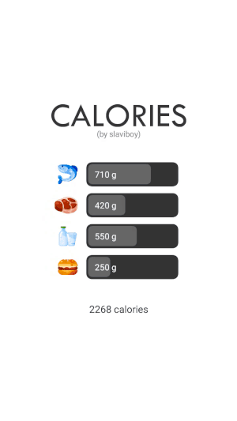
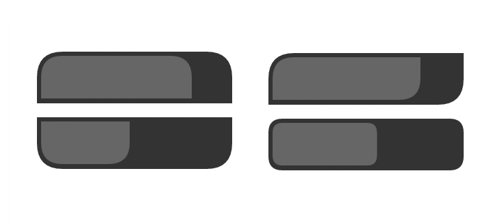

# SliderEditText
SliderEditText(Java) Library for creating edit text that can be used as slider
 

## Add to your project
Add the jitpack maven repository
```
allprojects {
  repositories {
    ...
    maven { url 'https://jitpack.io' }
  }
}
``` 
Add the dependency
```
dependencies {
  implementation 'com.github.slaviboy:SliderEditText:v0.1.0'
}
```


## Example

### Create SliderEditText View
Here is example how to create SliderEditText using **xml** 
```xml
<com.slaviboy.slideredittext.SliderEditText
  android:id="@+id/example
  android:layout_width="150dp"
  android:layout_height="47dp"
  android:textColor="#ffffff"
  android:textSize="13sp"
  app:background_padding="5dp"
  app:corner_radius="10dp"
  app:default_value="710"
  app:foreground_padding="3dp"
  app:range_lower="20
  app:range_upper="50
  app:round_decimal_places="2"
  app:prefix="~"
  app:suffix=" °"
  app:text_padding_left="18dp" />
```

Or you can create your view using **java** and set properties using getter and setter methods. This is the same way you create other views like Button, ImageView...
```JAVA
SliderEditText sliderEditText = new SliderEditText(this);                // pass context
sliderEditText.setLayoutParams(new LinearLayout.LayoutParams(300, 100)); // width and height
sliderEditText.setDefaultValue(35);
sliderEditText.setRoundDecimalPlaces(2);
sliderEditText.setPrefix("~");
sliderEditText.setSuffix("°");
sliderEditText.setRange(new Range(20, 50));
sliderEditText.setCornerRadius(new CornerRadius(20, 0, 0, 20));
sliderEditText.setForegroundPadding(new RectF(8, 8, 8, 8));
sliderEditText.setBackgroundPadding(new RectF(3, 3, 3, 3));
sliderEditText.setTextPadding(new RectF(25, 0, 0, 0));
```

### Add Listener
To listen for value change you can attach OnChangeListener with method onChange(), that will be called when view value is changed by the user
```JAVA
SliderEditText sliderEditText = findViewById(R.id.example);
sliderEditText.setOnChangeListener(new SliderEditText.OnChangeListener() {
  @Override
  public void onChange(SliderEditText slider) {
  
  }
});
```

## Documentation

### Corner Radius
You can set corner radius for all the corners at once or set value for each corner separately.
* **corner_radius** 
* **corner_radius_upper_left**
* **corner_radius_upper_right**
* **corner_radius_lower_left** 
* **corner_radius_lower_right** 


### Properties
Here is a list with all supported properties:

* **background_color** - *(default:#333333)* background color
* **foreground_color** - *(default:#666666)* foreground color
* **range_lower** - *(default:0)* lower range value
* **range_upper** - *(default:100)* upper range value
* **default_value** - *(default:0)* default value
* **round_decimal_places** - *(default:1)* to what decimal places to round the value
* **suffix** - *(default:"")* suffix put after the value
* **prefix** - *(default:"")* prefix put before the value
* **corner_radius** - *(default:0)* corner radius for the all cornern
* **corner_radius_upper_left** - *(default:0)* corner radius for the upper left corner
* **corner_radius_upper_right** - *(default:0)* corner radius for the upper right corner
* **corner_radius_lower_left** - *(default:0)* corner radius for the lower left corner
* **corner_radius_lower_right** - *(default:0)* corner radius for the lower right corner
* **background_padding** - *(default:0)* background padding for all four direction
* **background_padding_left** - *(default:0)* background padding for left direction
* **background_padding_top** - *(default:0)* background padding for top direction
* **background_padding_right** - *(default:0)* background padding for right direction
* **background_padding_bottom** - *(default:0)* background padding for bottom direction
* **foreground_padding** - *(default:0)* foreground padding for all four direction
* **foreground_padding_left** - *(default:0)* foreground padding for left direction
* **foreground_padding_top** - *(default:0)* foreground padding for top direction
* **foreground_padding_right** - *(default:0)* foreground padding for right direction
* **foreground_padding_bottom** - *(default:0)* foreground padding for bottom direction
* **text_padding** - *(default:0)* foreground padding for all four direction
* **text_padding_left** - *(default:0)* text padding for left direction
* **text_padding_top** - *(default:0)* text padding for top direction
* **text_padding_right** - *(default:0)* text padding for right direction
* **text_padding_bottom** - *(default:0)* text padding for bottom direction
